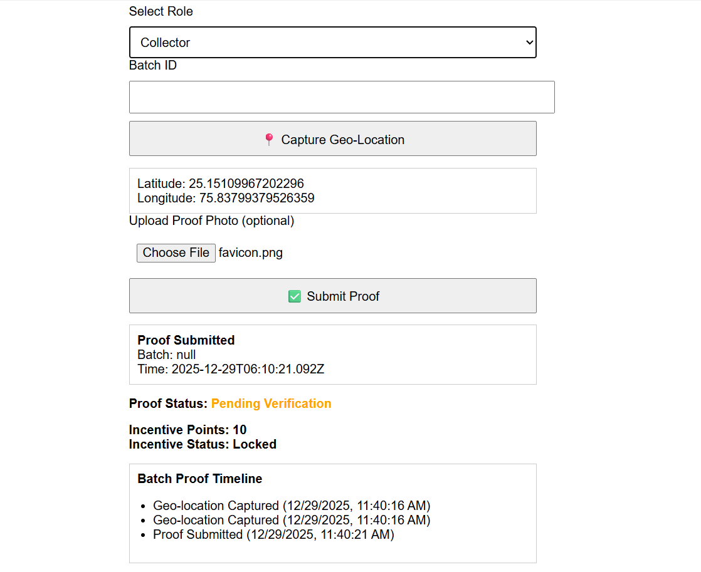
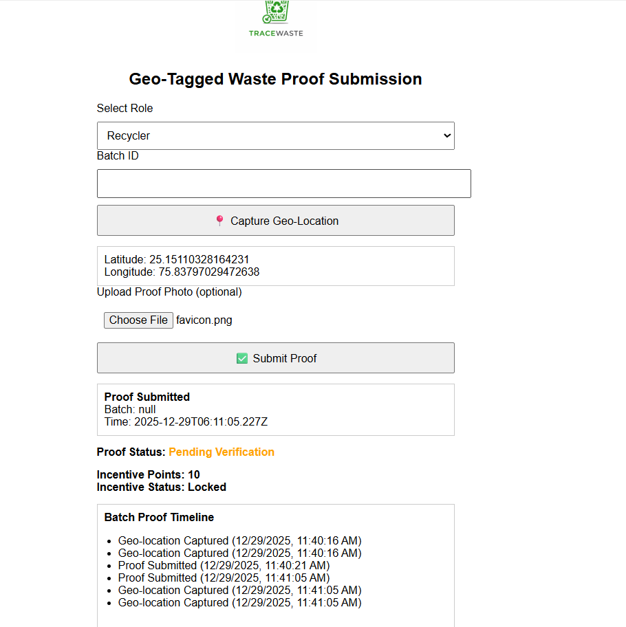
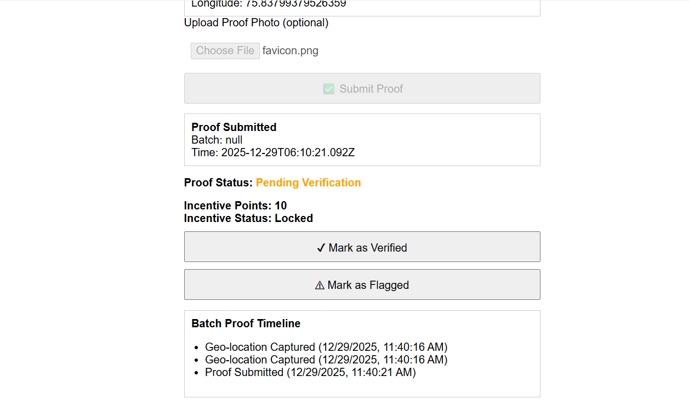

# TRACEWASTE ♻️  
### A Research-Driven, Proof-Based Waste Traceability System

**Hackathon:** Eco Champion Hackathon  
**Organised by:** Indian Institute of Technology (IIT), Hyderabad  
**Event:** Elan & nVision 2026  

TRACEWASTE is a lightweight, web-based system designed to improve **waste accountability** by making waste movement **traceable and verifiable** using QR codes, geo-tagged proof, role-based verification, and incentive locking.

This project was **designed after reviewing 10+ research papers, government guidelines, and waste audit reports** related to campus and municipal waste management.

---

## 🌍 Live Prototype

- **Main Website:**  
  https://milindsahu.github.io/geo-proof-demo/

- **QR Code Generator:**  
  https://milindsahu.github.io/geo-proof-demo/qr.html

---

## 📌 Motivation & Research Background

As a 19-year-old undergraduate student, I noticed that many campuses already practice waste segregation (dry, wet, e-waste). However, several studies and audit reports show that **segregation alone does not guarantee recycling**.

While reviewing research literature, one common issue appeared repeatedly:

- Waste is segregated at source  
- But **tracking usually stops after collection**  
- Recycling claims depend on **self-reporting**  
- Verification is rarely done  

This observation became the foundation of TRACEWASTE.

> **Key research insight:**  
> *If waste movement cannot be verified, recycling cannot be guaranteed.*

---

## 🚨 Problem Statement

Based on literature review and reports, current waste management systems face:

- Broken chain of custody after collection  
- No batch-level identification of waste  
- Manual inspections that are slow and costly  
- Incentives not linked to verified outcomes  

As a result, recyclable and hazardous waste often ends up in landfills despite segregation.

---

## 💡 Proposed Solution: TRACEWASTE

TRACEWASTE introduces **batch-level accountability** by linking physical waste to digital proof.

**Core idea:**  
> Every waste batch must generate verifiable digital evidence before it is considered compliant.

---

## 🔄 System Workflow

1. Waste is segregated and assigned a **Batch ID**  
2. A **QR code** is generated and attached to the batch  
3. QR is scanned during collection or processing  
4. **Geo-location and timestamp** are captured  
5. Proof is submitted through a web interface  
6. An independent auditor verifies or flags the proof  
7. Incentives are released only after verification  

---

## 🧩 Key Features

### 1️⃣ QR-Based Waste Batch Identification
- Unique QR code for each waste batch  
- No RFID, GPS trackers, or smart bins  
- Works with existing waste infrastructure  

---

### 2️⃣ Geo-Tagged & Time-Stamped Proof
- Uses standard browser geolocation  
- Captures latitude, longitude, and time  
- Optional photo upload for visual proof  

---

### 3️⃣ Role-Based Access Control
The system supports three roles:
- **Collector** – submits waste movement proof  
- **Recycler** – submits processing proof  
- **Auditor** – verifies or flags submissions  

This ensures **separation of duties**.

---

### 4️⃣ Verification States
Each waste batch moves through:
- `Not Submitted`  
- `Pending Verification`  
- `Verified` ✅  
- `Flagged` ⚠️  

---

### 5️⃣ Incentive Mechanism (Research-Informed)
Literature shows that incentives without verification can be misused.  
TRACEWASTE therefore follows a simple rule:

> **No verification = No reward**

- Incentives are locked on submission  
- Released only after verification  
- Cancelled if proof is flagged  

---

### 6️⃣ Batch Proof Timeline
All actions are logged chronologically:
- QR scanned  
- Geo-location captured  
- Proof submitted  
- Verified or flagged  

This creates a clear **audit trail**.

---

## 🖥️ Interface Walkthrough (Correct System Order)

### 📱 1️⃣ QR Scan (Entry Point)

---

### 📦 2️⃣ QR Code Generation

---

### 🟢 3️⃣ Collector Interface

---

### 🔵 4️⃣ Recycler Interface

---

### 🟠 5️⃣ Auditor Interface

---

## 🛠️ Technology Stack

- HTML, CSS, JavaScript  
- Browser Geolocation API  
- QRCode.js  
- GitHub Pages (static hosting)

No backend, database, blockchain, or proprietary services are used.

---

## 💸 Cost & Scalability Analysis

| Deployment Scale | Cost per Batch |
|------------------|----------------|
| Pilot (10 batches) | ₹0–₹10 |
| 100 batches | ₹0–₹5 |
| 1,000+ batches | ~₹0 |

The only physical cost is QR printing, making the system highly scalable.

---

## 🌱 Sustainability & Impact

TRACEWASTE supports long-term environmental impact by:
- Improving recycling accountability  
- Reducing illegal dumping  
- Lowering monitoring costs  
- Enabling transparent audits  

The system is affordable, replicable, and suitable for real-world deployment.

---

## 🔮 Future Scope

- Integration with certified recycler databases  
- Location consistency checks  
- Municipal or campus dashboards  
- Secure storage of proof records  

---

## 📚 References (Literature Reviewed)

1. CPCB, *Guidelines on Solid Waste Management in Educational Institutions*, India, 2016.  
2. MoHUA, *Solid Waste Management Rules*, Government of India, 2016.  
3. World Bank, *What a Waste 2.0*, 2018.  
4. UNEP, *Waste Management Outlook for Asia and the Pacific*, 2017.  
5. Sharholy et al., *Waste Management*, 2008.  
6. Guerrero et al., *Waste Management*, 2013.  
7. Dwivedi & Gupta, *Journal of Environmental Studies*, 2019.  
8. Baldé et al., *Global E-waste Monitor*, UNU, 2020.  
9. Zhang et al., *Journal of Cleaner Production*, 2015.  
10. OECD, *Extended Producer Responsibility*, 2016.  

*A detailed literature review is included in the project report.*

---

## 🧠 Personal Reflection

This project showed me that impactful environmental solutions do not always need complex hardware or advanced technology. Careful study of existing systems and designing for accountability can create meaningful change using simple tools.

---

## 👤 Author

**Milind Sahu**  
Undergraduate Student (Age 19)  
Eco Champion Hackathon Finalist  
Indian Institute of Science Education and Research (IISER), Tirupati

---

## 🏁 Final Note

TRACEWASTE is designed to be:
- Research-informed  
- Practical  
- Affordable  
- Scalable  

The focus is on **verification and accountability**, not assumptions.
